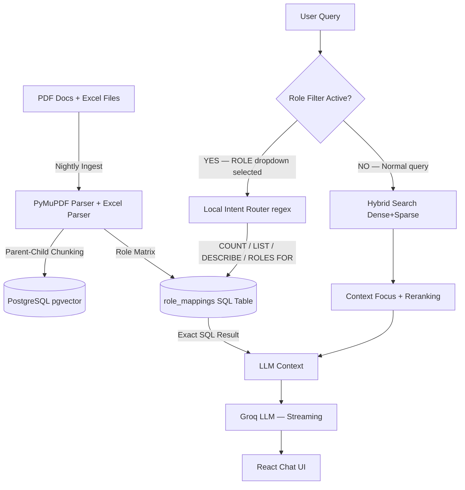

# Document Intelligence Assistant — YOUR_PRODUCT RAG Chatbot

An enterprise-grade, layout-aware **Retrieval-Augmented Generation (RAG)** system designed for YourOrganization to ingest, parse, search, and answer technical questions from YOUR_PRODUCT manuals, SFS release documents, and Role Attribute matrices — with exact page-level citations and a relational SQL layer for 100% accurate role/attribute queries.

---

## ✨ What This System Does

- **Chat with your PDFs** — Ask any question about YOUR_PRODUCT, MFA, SFS, STP and get sourced answers with page references
- **Role Attributes Matrix** — Switch to the **ROLE filter** and query the Role Attributes Excel database with 100% SQL accuracy (no hallucination)
- **Section Search Bar** — Click any Role Attribute name to instantly see which classes, groups, and roles are assigned to it
- **Streaming Responses** — Answers stream token-by-token via SSE for a fast, responsive feel
- **Incremental Ingestion** — New documents auto-detected and indexed overnight (watcher disabled during bot runtime to prevent slowdowns)

---

## 🏗 System Architecture



---

## 📁 File Structure

```
ai layer/
├── api.py                        # FastAPI backend — REST + SSE streaming
├── frontend/src/ChatUI.jsx       # React chat interface
├── src/
│   ├── config.py                 # All env vars, model names, limits
│   ├── postgres_store.py         # PostgreSQL vector store + role SQL methods
│   ├── intent_router.py          # Zero-cost local regex intent router (no API call)
│   ├── ingest_batch.py           # Parallel PDF ingestion
│   ├── ingest_roles.py           # Excel Role Attributes ingestion → role_mappings table
│   ├── watcher.py                # File watcher for incremental ingestion (run at night)
│   ├── retrieval.py              # Hybrid search orchestration
│   ├── rag.py                    # RAG pipeline + context formatting
│   ├── llm.py                    # Groq LLM integration
│   ├── llm_stream.py             # Streaming LLM response handler
│   ├── query_router.py           # Intent detection + product routing
│   ├── query_context.py          # Follow-up resolution
│   └── context_focus.py         # Page-collapse for dense procedural answers
├── requirements.txt
├── docker-compose.yml            # PostgreSQL with pgvector
└── .env                          # API keys and config (do NOT commit)
```

---

## ⚡ Key Features

### 1. Dual-Mode Retrieval
| Mode | Trigger | How it works |
|---|---|---|
| **Normal RAG** | No filter / any filter except ROLE | Hybrid vector + FTS search → LLM |
| **SQL Mode** | ROLE selected in Product Filter | Local regex router → exact PostgreSQL query |

### 2. SQL Role Attributes (Zero Hallucination)
When **ROLE** is selected in the filter dropdown, **every** query goes through the SQL pipeline:
- `"list all attributes of basic user"` → `GET_ATTRIBUTES_FOR_ROLE` → exact SQL
- `"list all roles having converter attr"` → `GET_ROLES_FOR_ATTRIBUTE` → exact SQL  
- `"how many attributes does ODI role have?"` → `COUNT_ATTRIBUTES` → exact SQL
- `"describe converter"` → `DESCRIBE_ATTRIBUTE` → exact SQL

### 3. Intent Router (Local — No API Cost)
`src/intent_router.py` uses pure Python regex — **zero Groq API calls** for routing. Runs in microseconds with no rate limits.

### 4. Exact Match First
All SQL queries prefer **exact attribute/role name match** before falling back to partial match. `"converter"` returns only **Converter** — not Converter Cooling, Converter Config, etc.

### 5. Parent-Child Chunking
Child chunks (~200 chars) are indexed for retrieval. Parent chunks (~3000 chars) are passed to the LLM — preserving full tables and section context.

---

## 🚀 Quick Start

### 1. Prerequisites
- Python 3.11+
- Docker Desktop (for PostgreSQL)
- Node.js 18+ (for frontend)

### 2. Setup
```powershell
# Activate virtual environment
.\.venv\Scripts\Activate.ps1

# Install Python dependencies
pip install -r requirements.txt

# Copy and configure environment variables
copy .env.example .env
# Edit .env: set GROQ_API_KEY, DB_HOST, DB_PASSWORD, etc.
```

### 3. Start PostgreSQL
```powershell
docker-compose up -d
```

### 4. Ingest Documents (Run Once, or Nightly)
```powershell
# Ingest PDFs
python -m src.ingest_batch

# Ingest Role Attributes Excel → SQL table
python src/ingest_roles.py
```

### 5. Start the Backend API
```powershell
uvicorn api:app --reload --port 8000
```

### 6. Start the Frontend
```powershell
cd frontend
npm install
npm run dev
```
Open **http://localhost:5173**

---

## ⚙️ Key Environment Variables (`.env`)

| Variable | Description |
|---|---|
| `GROQ_API_KEY` | Groq API key for LLM inference |
| `DB_HOST` | PostgreSQL host (default: `localhost`) |
| `DB_PORT` | PostgreSQL port (default: `5432`) |
| `DB_NAME` | Database name |
| `DB_USER` | Database user |
| `DB_PASSWORD` | Database password |
| `OLLAMA_MODEL` | LLM model name (e.g. `llama-3.1-8b-instant`) |
| `MAX_CONTEXT_CHARS` | Max context window sent to LLM (default: `14000`) |
| `TOP_K` | Number of chunks retrieved (default: `7`) |

---

## 🌙 Nightly Ingestion (Recommended for Production)

The watcher is **disabled** during bot runtime to prevent slowdowns. Run ingestion on a schedule:

**Windows Task Scheduler** — Run at midnight:
```powershell
.\.venv\Scripts\python.exe src\watcher.py
```
Or individually:
```powershell
.\.venv\Scripts\python.exe -m src.ingest_batch
.\.venv\Scripts\python.exe src\ingest_roles.py
```

---

## 🏢 Production Deployment (Enterprise Scale)

> ⚠️ Groq free/paid tier is suitable for development only. For 100+ concurrent users with confidential documents:

| Option | Recommendation |
|---|---|
| **Azure OpenAI** | ✅ Best — data stays in Your Azure tenant, enterprise SLA, GDPR compliant |
| **On-prem Ollama** | ✅ Most secure — zero internet, air-gapped, no data leaves building |
| **Groq Paid** | ⚠️ Development/demo only — data leaves your network |

To switch to **Azure OpenAI**, change 2 env variables in `.env`:
```env
GROQ_API_KEY=<your-azure-openai-key>
OLLAMA_BASE_URL=https://<your-resource>.openai.azure.com/openai/deployments/<deployment>
```

---

## ❓ FAQ

**Q: The bot found the right document but said "I cannot find information" — why?**  
A: Fixed in latest version. The context window was too small and cutting off table content. `MAX_CONTEXT_CHARS` is now 14000.

**Q: Queries work for PROJECT_NAME but give wrong answers for MFA — why?**  
A: Short queries like "mfa config" were being treated as follow-ups to previous queries. Fixed — only explicit pronouns like "it/this/that" now trigger follow-up resolution.

**Q: Why are some role attributes duplicated in output?**  
A: Fixed — all SQL functions now deduplicate at the database level using `SELECT DISTINCT` and exact-match-first logic.

**Q: Can I ask "list all attributes of Basic user" without selecting the ROLE filter?**  
A: No — the ROLE filter dropdown is the sole trigger for SQL mode. Without it, the query goes through normal semantic search.

**Q: Why is the watcher disabled during bot runtime?**  
A: Incremental ingestion is CPU/IO intensive and slows down response times. Run it nightly instead.
