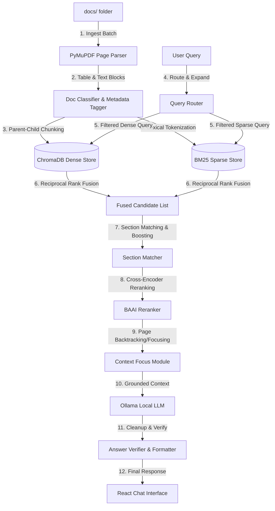

# Enterprise Section-Aware PDF RAG Chatbot

An enterprise-grade, layout-aware **Retrieval-Augmented Generation (RAG)** system designed to ingest, parse, search, and answer technical questions from complex manuals (like YourOrganization YOUR_PRODUCT manuals) while providing exact page-level and section-level citations.

---

## 🏗 System Architecture Overview

The system is composed of a **React + Vite Frontend**, a **FastAPI Backend REST API**, and a state-of-the-art layout-aware **Retrieval & Parsing Pipeline**.



---

## 📁 Repository Layout & File Descriptions

### 🔌 Connectors & Document Management
*   **[src/artifactory_connector.py](file:///C:/path/to/ai-layer/src/artifactory_connector.py)**: JFrog Artifactory scanning client. Contains AQL queries to locate new `*.pdf` files in remote artifactory stores and stream them locally, alongside a mock implementation for local verification.
*   **[src/sharepoint_connector.py](file:///C:/path/to/ai-layer/src/sharepoint_connector.py)**: SharePoint Office365 REST API document connector. Contains configurations to scan SharePoint folders and list PDFs.
*   **[src/document_manager.py](file:///C:/path/to/ai-layer/src/document_manager.py)**: The central registry mapping indexed files (`indexed_documents`) to their SHA-256 content hashes, page counts, and indexing timestamps. This enables **incremental updates**, ensuring unchanged files are never re-embedded.

### 📥 Ingestion & Document Parsing
*   **[src/ingest.py](file:///C:/path/to/ai-layer/src/ingest.py)**: Core ingestion entry point. Triggers full re-indexing of documents into ChromaDB and builds the sparse search corpus.
*   **[src/ingest_batch.py](file:///C:/path/to/ai-layer/src/ingest_batch.py)**: Enhanced parallel indexer using `ThreadPoolExecutor`. Supports full re-indexing and incremental file ingestion.
*   **[src/pdf_loader.py](file:///C:/path/to/ai-layer/src/pdf_loader.py)**: Layout-aware parser utilizing PyMuPDF (`fitz`). Identifies text blocks and extracts tables, formatting them into Markdown pipes (`TABLE:\n col1 | col2`). It implements **Parent-Child Chunking**, where child search-chunks are aligned with larger parent context blocks centered on the child.
*   **[src/doc_registry.py](file:///C:/path/to/ai-layer/src/doc_registry.py)**: Document classification module. Parses filenames dynamically using regex to classify PDFs into specific products (e.g. `project_name`, `project_module`), document types (`user_manual`, `install_guide`, `security_manual`), versions, and flags demo files.

### 🔍 Retrieval & Re-Ranking
*   **[src/vector_store.py](file:///C:/path/to/ai-layer/src/vector_store.py)**: Interfaces with **ChromaDB** using `all-MiniLM-L6-v2` embeddings. Manages collection creation, vector queries, batching, metadata tags, and page segment extraction.
*   **[src/bm25_store.py](file:///C:/path/to/ai-layer/src/bm25_store.py)**: Manages the sparse retrieval corpus via the `rank-bm25` library, persisting indexes to disk using python pickle.
*   **[src/retrieval.py](file:///C:/path/to/ai-layer/src/retrieval.py)**: Orchestrates metadata-filtered hybrid search. Blends dense and sparse search results via Reciprocal Rank Fusion (RRF). Detects section-level matches, handles query intent constraints, boosts section content, triggers page-level backtracking, and performs cross-encoder re-ranking.
*   **[src/reranker.py](file:///C:/path/to/ai-layer/src/reranker.py)**: Connects to a local sentence-transformer `BAAI/bge-reranker-base` cross-encoder to dynamically re-evaluate candidate-context alignment scores.
*   **[src/context_focus.py](file:///C:/path/to/ai-layer/src/context_focus.py)**: Implements context collapse for procedural questions. Identifies if the query is a procedure, collapses retrieval to the best-matching consecutive page sequences within dominant manuals, and prevents text-bleeding from unrelated topics.
*   **[src/section_matcher.py](file:///C:/path/to/ai-layer/src/section_matcher.py)**: Strictly matches document headings with queries, detects section transitions (parent-child section hierarchies, notes, warnings, table continuations), and extracts complete sections for LLM contexts.

### 🧠 Query Understanding & Response Logic
*   **[src/query_router.py](file:///C:/path/to/ai-layer/src/query_router.py)**: Detects intent classification (`version_history`, `definition`, `field_detail`, `architecture`, `how_to`, `general`), resolves product focuses, and expands queries into multi-angle search queries.
*   **[src/query_context.py](file:///C:/path/to/ai-layer/src/query_context.py)**: Handles conversation context. Reconstructs implicit subjects, resolves acronym references, and tracks follow-up contexts.
*   **[src/rag.py](file:///C:/path/to/ai-layer/src/rag.py)**: Main RAG orchestrator. Intercepts ambiguous section titles (triggering an early-return selection prompt), calls Ollama generation, and applies formatting and verification.
*   **[src/llm.py](file:///C:/path/to/ai-layer/src/llm.py)**: Connects to **Ollama** via HTTP request payloads. Incorporates system prompt rules to enforce anti-hallucination and step consistency.
*   **[src/verifier.py](file:///C:/path/to/ai-layer/src/verifier.py)**: Cross-corpus integrity verifier. Enforces product consistency (blocking answers that mix YOUR_PRODUCT manuals), validates software release version claims, and flags cross-corpus leakage.
*   **[src/answer_formatter.py](file:///C:/path/to/ai-layer/src/answer_formatter.py)**: Cleans LLM output by deduplicating paragraphs, steps, and bullet points. Strips leaked document headers, figure references, and standalone citation blocks.

### 🖥 Interfaces & Configuration
*   **[api.py](file:///C:/path/to/ai-layer/api.py)**: REST API exposed via FastAPI. Exposes `/chat` (with chat history and JSON request schemas), `/documents`, and `/health` endpoints.
*   **[ui.py](file:///C:/path/to/ai-layer/ui.py)**: Simple web interface written using Gradio for rapid backend testing.
*   **[src/chat_cli.py](file:///C:/path/to/ai-layer/src/chat_cli.py)**: Terminal-based interact-loop.
*   **[src/config.py](file:///C:/path/to/ai-layer/src/config.py)**: Holds central path bindings, models, hyperparameters, and environment variable overrides.

### 🌐 Frontend Client
*   **[frontend/src/ChatUI.jsx](file:///C:/path/to/ai-layer/frontend/src/ChatUI.jsx)**: Polished React component managing chat history state, filters, copy/export, search history, and response abortion.
*   **[frontend/src/ChatUI.css](file:///C:/path/to/ai-layer/frontend/src/ChatUI.css)**: Glossy layout styles utilizing glassmorphism overlays, animations, and CSS variables for light/dark themes.

---

## ⚡ Key Retrieval Capabilities

### 1. Parent-Child Chunking
Traditional RAG embeds large pages, washing out details. Simple chunking loses context. 
This pipeline extracts:
*   **Child Chunks (~200 characters)**: Highly distinct lexical fragments, optimized for dense vector embedding and sparse search matching.
*   **Parent Chunks (~3000 characters)**: Page-level contextual blocks centered on the matching child chunk. When a child matches, its parent block is sent to the LLM, preserving context, headings, and warning notes.

### 2. Multi-Manual Context Collapse (Context Focus)
When answers are localized on specific pages (e.g. "How to install PROJECT_NAME Central Agent"), retrieval uses lexical-overlap scoring and backtracking to isolate consecutive pages inside the dominant manual. This blocks bleeding/mixing of instructions from unrelated chapters, while still allowing sections from multiple manuals to be referenced for comparative questions.

### 3. Strict Answer Verifier
Enterprise systems cannot afford LLM hallucinations. The verifier performs strict checks on the output:
*   **Product Check**: If the user asks about PROJECT_MODULE, but the LLM answers using PROJECT_NAME, the answer is rejected.
*   **Release Version Check**: If the LLM mentions software release versions or year/months, the verifier checks if they were in the retrieved context. If not, the verifier rejects the answer and prints the raw retrieved snippets directly, alerting the user.
*   **Contamination Check**: Enforces that placeholder or sample service markers (like `payment.events`) do not bleed into queries regarding actual product manuals.

---

## 🚀 Quick Start Guide

### 1. Requirements & Setup

Ensure Python 3.11+ is installed, then create and activate a virtual environment:

```powershell
# Navigate to project root
cd "C:\path\to\ai-layer"

# Create and activate environment
python -m venv .venv
.\.venv\Scripts\Activate.ps1

# Install dependencies
pip install -r requirements.txt

# Setup environment variables
copy .env.example .env
```

### 2. Local LLM Setup (Ollama)
1. Download and run [Ollama](https://ollama.com).
2. Pull the default technical LLM:
   ```powershell
   ollama pull llama3.2
   ```
3. Set `OLLAMA_MODEL=llama3.2` and `OLLAMA_TIMEOUT=600` inside your `.env` file.

### 3. Document Ingestion

Place your manuals inside the directories specified in your `.env` (or copy them to the local `docs/` folder). Re-run ingestion to build dense and sparse indexes:

```powershell
# Incremental indexing (only indexes new/modified PDFs)
python -m src.ingest_batch --mode incremental

# Full index rebuild (overwrites existing indexes)
python -m src.ingest_batch --mode full
```

### 4. Running the Applications

#### Start the FastAPI Backend Server
```powershell
uvicorn api:app --reload --port 8000
```

#### Start the React Frontend Application
```powershell
cd frontend
npm install
npm run dev
```
Open **http://localhost:5173** to chat with the local manuals.

#### Run Simple Gradio Test Interface
```powershell
python ui.py
```

---

## 🧪 Testing & Validation

To check retrieval accuracy and prevent regressions, run the golden test suites:

```powershell
# Run PyTest metrics
python -m pytest tests/test_golden_retrieval.py -v

# Run golden test script
python scripts/run_golden_tests.py
```
Add new regression patterns directly into [tests/golden/questions.json](file:///C:/path/to/ai-layer/tests/golden/questions.json).
