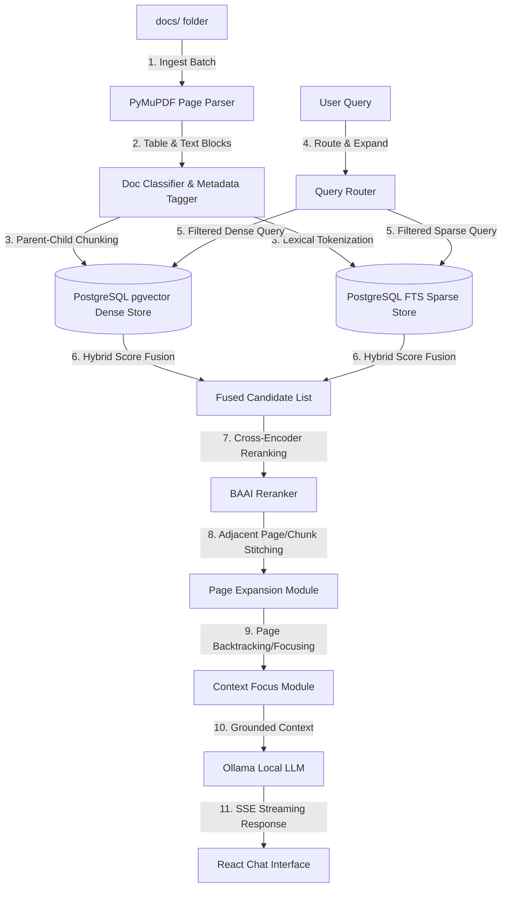

# Enterprise Section-Aware PDF RAG Chatbot

An enterprise-grade, layout-aware **Retrieval-Augmented Generation (RAG)** system designed to ingest, parse, search, and answer technical questions from complex manuals (like YourOrganization YOUR_PRODUCT manuals) while providing exact page-level and section-level citations.

---

## ✨ Recent Pipeline Enhancements

The system has been heavily optimized for edge cases involving dense procedural manuals:

*   **Multi-Page Procedure Stitching:** Cross-encoder rerankers notoriously penalize "continuation pages" because they lack the query's keywords. The pipeline now expands and fetches adjacent pages *after* the reranking phase, guaranteeing seamless step-by-step instructions across page boundaries.
*   **Intra-Page Chunk Restitching:** If a single long page is split into multiple vector chunks and the reranker drops the bottom half, the system automatically detects this and re-stitches the missing chunks back into the context.
*   **Table & Checklist Preservation:** Duplicate sentence filters have been removed to protect repetitive checklist rows (e.g., `FAT` and `SAT` formats) and strict tabular configurations from being erased.
*   **Procedural Context Enlargement:** The chunk limit dynamically expands from `7` up to `15` when a `how-to` procedural question is detected, preventing truncation when multiple versions of the same manual exist in the corpus.
*   **Recency-Biased History Resolution:** Multi-turn follow-ups (e.g., "give me the steps from first") now traverse the chat history in reverse chronological order, preventing the context engine from getting trapped on older, unrelated topics.
*   **Comparison Intent Routing:** The Query Router now formally detects contrastive intents (e.g., "compare PROJECT_MODULE and PROJECT_NAME"), forcing the hybrid search to retrieve equivalent configurations from both product spaces.
*   **CPU Latency Optimization:** The intermediate Cross-Encoder candidate limit was reduced from 15 to 8, yielding a ~45% reduction in scoring latency on CPU setups with zero loss in final answer quality.

---

## 🏗 System Architecture Overview

The system is composed of a **React + Vite Frontend**, a **FastAPI Backend REST API**, and a state-of-the-art layout-aware **Retrieval & Parsing Pipeline**.



---

## 📁 Repository Layout & File Descriptions

### 🔌 Connectors & Document Management
*   **[src/artifactory_connector.py]**: JFrog Artifactory scanning client.
*   **[src/sharepoint_connector.py]**: SharePoint Office365 REST API document connector.
*   **[src/document_manager.py]**: The central registry mapping indexed files to hashes, enabling incremental updates.

### 📥 Ingestion & Document Parsing
*   **[src/ingest_batch.py]**: Enhanced parallel indexer using `ThreadPoolExecutor`. Supports full re-indexing and incremental file ingestion.
*   **[src/pdf_loader.py]**: Layout-aware parser utilizing PyMuPDF (`fitz`). Implements Parent-Child Chunking.
*   **[src/doc_registry.py]**: Document classification module. Parses filenames dynamically using regex and a strict `_STOP_PRODUCTS` list to classify PDFs.

### 🔍 Retrieval & Re-Ranking
*   **[src/vector_store.py]** & **[src/postgres_store.py]**: Interfaces with **PostgreSQL** using `pgvector` for dense semantic embeddings and native Full-Text Search (FTS).
*   **[src/retrieval.py]**: Orchestrates metadata-filtered hybrid search. Blends dense and sparse results, applies CPU cross-encoder reranking, and seamlessly stitches missing intra-page chunks.
*   **[src/context_focus.py]**: Collapses retrieval to the best-matching consecutive page sequences within dominant manuals.

### 🧠 Query Understanding & Response Logic
*   **[src/query_router.py]**: Detects intent classification (e.g. `how_to`, `comparison`), resolves product focuses, and expands queries.
*   **[src/query_context.py]**: Handles conversation context with recency-biased topic resolution.
*   **[src/rag.py]**: Main RAG orchestrator that constructs the final prompt blocks, ensuring tabular structures and empty headings are preserved.

### 🖥 Interfaces & Configuration
*   **[api.py]**: REST API exposed via FastAPI.
*   **[src/config.py]**: Holds central path bindings, models, hyperparameters, and overrides.
*   **[frontend/src/ChatUI.jsx]**: Polished React component that natively consumes Server-Sent Events (SSE) to stream answers.

---

## ⚡ Key Retrieval Capabilities

### 1. Parent-Child Chunking
Traditional RAG embeds large pages, washing out details. Simple chunking loses context. This pipeline extracts **Child Chunks (~200 chars)** optimized for dense search, but pairs them with **Parent Chunks (~3000 chars)** which are sent to the LLM to preserve headings and context.

### 2. Multi-Manual Context Collapse (Context Focus)
When answers are localized on specific pages (e.g. "How to install PROJECT_NAME"), retrieval uses lexical-overlap scoring to isolate consecutive pages inside the dominant manual. 

### 3. Strict Answer Verifier
Enterprise systems cannot afford LLM hallucinations. The verifier performs strict checks on the output:
*   **Product Check**: Blocks PROJECT_MODULE instructions from bleeding into PROJECT_NAME answers.
*   **Release Version Check**: Prevents hallucinated software versions.

---

## 🚀 Quick Start Guide

### 1. Requirements & Setup

Ensure Python 3.11+ is installed, then create and activate a virtual environment:

```powershell
# Navigate to project root
cd "C:\path\to\ai-layer"

# Create and activate environment
python -m venv .venv
.\.venv\Scripts\Activate.ps1

# Install dependencies
pip install -r requirements.txt

# Setup environment variables
copy .env.example .env
```

### 2. Local PostgreSQL & LLM Setup
1. **Start the PostgreSQL database** (with `pgvector`) using the provided Docker Compose file:
   ```powershell
   docker-compose up -d
   ```
2. Download and run [Ollama](https://ollama.com).
3. Pull the default technical LLM:
   ```powershell
   ollama pull llama3.2
   ```

### 3. Document Ingestion
Place your manuals inside the directories specified in your `.env` (or `docs/`). 
```powershell
# Incremental indexing (only indexes new/modified PDFs)
python -m src.ingest_batch --mode incremental
```

### 4. Running the Applications
Open **two separate terminal windows**.

#### Terminal 1: Start the FastAPI Backend Server
```powershell
.\.venv\Scripts\Activate.ps1
uvicorn api:app --reload --port 8000
```

#### Terminal 2: Start the React Frontend Application
```powershell
cd frontend
npm install
npm run dev
```
Open **http://localhost:5173** to chat with the local manuals.

---

## ❓ FAQ (Frequently Asked Questions)

**Q: Why does the system occasionally list 5-6 references from the same manual for one question?**
A: When you ask a procedural question (e.g., "how to map roles"), the algorithm gathers all consecutive pages (e.g., Pages 12, 13, 14, 15) to ensure it does not truncate any steps. Each page or chunk is listed as a separate reference so you can pinpoint exactly where the LLM derived each step.

**Q: My PDF has multiple versions in the folder (e.g., Version 1.0, 1.1, 1.2). Will the chatbot get confused?**
A: The RAG engine retrieves the highest scoring hits. If multiple identical versions exist, they will all rank equally high. The system will group them and load chunks from multiple versions into the context window. However, to avoid duplicate manuals starving the context limit, procedural queries allow an expanded `15-chunk` window to capture the full steps.

**Q: Why do tabular formats (like FAT/SAT) sometimes look slightly unformatted in the chat window?**
A: The pipeline extracts PDF tables into markdown pipes (`| Column 1 | Column 2 |`). While we have explicitly removed semantic deduplication filters that previously destroyed tables, extremely complex nested tables inside the PDF may still flatten out depending on how the `PyMuPDF` parser interprets the grid layout.

**Q: I asked a follow-up question, but it answered based on a completely different topic I asked 10 minutes ago. Why?**
A: This issue (context drift) has been fixed in the latest update. The context resolver now scans your history in *reverse chronological order* (recency bias). If you simply say "continue the steps", it will automatically bind to the exact topic you asked immediately prior. 

**Q: What happens if the LLM hallucination verifier blocks a response?**
A: If the verifier catches the LLM hallucinating a software release version or mixing up products (e.g. PROJECT_NAME vs PROJECT_MODULE), it intercepts the final response. Instead of returning the hallucinated text, it will print a safety warning along with the exact, verbatim text excerpts retrieved from the manual.

---

## 🧪 Testing & Validation

To check retrieval accuracy and prevent regressions, run the golden test suites:

```powershell
python -m pytest tests/test_golden_retrieval.py -v
python scripts/run_golden_tests.py
```
